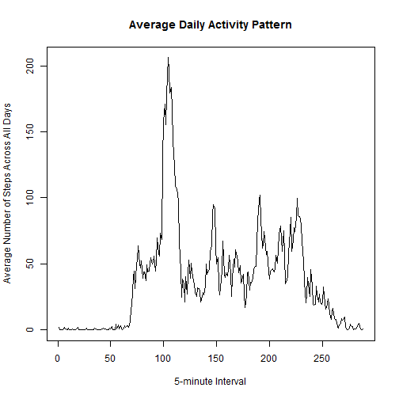

title: "PA1_template": Activity Monitoring Report
author: "G. Sheth"
date: "Thursday, May 14, 2015"
output: html_document


Activity Monitoring Report

This is an R Markdown document with embedded R code. 

In this report, I will show you the R code and the output of the following: 
Loaded activity data, mean total number of steps taken per day, average daily pattern, imputing missing values, and difference in weekdays and weekend patterns.

Load data:

```r
##Call needed library packages:
        library("data.table")
        library("reshape2")
        library("knitr")
        library("xtable")
        library("datasets")
        library("graphics")
        library("ggplot2")
        library("dplyr")
        library("lattice")

##Set working directory
        setwd("~/")

##1. Load the data from csv file:
        actdata <- read.csv("activity.csv", stringsAsFactors = FALSE)
```
Data loaded.

Check that the Date field is set to the Date class:

```r
##2. Process and transform data:
   ##Check the class of each element:
    sapply(actdata[1,],class)
```

```
##       steps        date    interval 
##   "integer" "character"   "integer"
```

```r
     ##     steps        date    interval 
     ##   "integer" "character"   "integer"

    ##Change date from character to date class:
        actdata$date <- as.Date(actdata$date)
    ##Run sapply to check for date class:
        ##sapply(actdata[1,],class)
            ##   steps      date  interval 
            ##"integer"    "Date" "integer"
```
Date is of class Date.


What is the mean total number of steps taken per day?
I will calcuate total steps per day:

```r
##1. Calculate the total number of steps taken each day:

##Sum of taken steps by date: 
  ##Note: It was good to reference my old Swirl lessons to do this:
    ##Must include the dplyr package in order to use this syntax:
    actdatasumup <- actdata %>%
      group_by(date) %>%
      summarise(ttsteps = sum(steps))

##2. Build histogram:
hist(actdatasumup$date, col="blue", las=1, breaks = 20, freq=FALSE, main="Total Number of Steps Taken Each Day", xlab="Day", ylab="Steps Taken")
```

 
Histogram generated.

Caculate mean and median:

```r
##3. Get the mean and median of total steps taken per day:
##Overall mean and median:
    mean(actdatasumup$ttsteps, na.rm = TRUE)
```

```
## [1] 10766.19
```

```r
    median(actdatasumup$ttsteps, na.rm = TRUE)
```

```
## [1] 10765
```

```r
##Mean and median for each day:
    tapply(actdatasumup$ttsteps, actdatasumup$date, mean)
```

```
## 2012-10-01 2012-10-02 2012-10-03 2012-10-04 2012-10-05 2012-10-06 
##         NA        126      11352      12116      13294      15420 
## 2012-10-07 2012-10-08 2012-10-09 2012-10-10 2012-10-11 2012-10-12 
##      11015         NA      12811       9900      10304      17382 
## 2012-10-13 2012-10-14 2012-10-15 2012-10-16 2012-10-17 2012-10-18 
##      12426      15098      10139      15084      13452      10056 
## 2012-10-19 2012-10-20 2012-10-21 2012-10-22 2012-10-23 2012-10-24 
##      11829      10395       8821      13460       8918       8355 
## 2012-10-25 2012-10-26 2012-10-27 2012-10-28 2012-10-29 2012-10-30 
##       2492       6778      10119      11458       5018       9819 
## 2012-10-31 2012-11-01 2012-11-02 2012-11-03 2012-11-04 2012-11-05 
##      15414         NA      10600      10571         NA      10439 
## 2012-11-06 2012-11-07 2012-11-08 2012-11-09 2012-11-10 2012-11-11 
##       8334      12883       3219         NA         NA      12608 
## 2012-11-12 2012-11-13 2012-11-14 2012-11-15 2012-11-16 2012-11-17 
##      10765       7336         NA         41       5441      14339 
## 2012-11-18 2012-11-19 2012-11-20 2012-11-21 2012-11-22 2012-11-23 
##      15110       8841       4472      12787      20427      21194 
## 2012-11-24 2012-11-25 2012-11-26 2012-11-27 2012-11-28 2012-11-29 
##      14478      11834      11162      13646      10183       7047 
## 2012-11-30 
##         NA
```

```r
    tapply(actdatasumup$ttsteps, actdatasumup$date, median)
```

```
## 2012-10-01 2012-10-02 2012-10-03 2012-10-04 2012-10-05 2012-10-06 
##         NA        126      11352      12116      13294      15420 
## 2012-10-07 2012-10-08 2012-10-09 2012-10-10 2012-10-11 2012-10-12 
##      11015         NA      12811       9900      10304      17382 
## 2012-10-13 2012-10-14 2012-10-15 2012-10-16 2012-10-17 2012-10-18 
##      12426      15098      10139      15084      13452      10056 
## 2012-10-19 2012-10-20 2012-10-21 2012-10-22 2012-10-23 2012-10-24 
##      11829      10395       8821      13460       8918       8355 
## 2012-10-25 2012-10-26 2012-10-27 2012-10-28 2012-10-29 2012-10-30 
##       2492       6778      10119      11458       5018       9819 
## 2012-10-31 2012-11-01 2012-11-02 2012-11-03 2012-11-04 2012-11-05 
##      15414         NA      10600      10571         NA      10439 
## 2012-11-06 2012-11-07 2012-11-08 2012-11-09 2012-11-10 2012-11-11 
##       8334      12883       3219         NA         NA      12608 
## 2012-11-12 2012-11-13 2012-11-14 2012-11-15 2012-11-16 2012-11-17 
##      10765       7336         NA         41       5441      14339 
## 2012-11-18 2012-11-19 2012-11-20 2012-11-21 2012-11-22 2012-11-23 
##      15110       8841       4472      12787      20427      21194 
## 2012-11-24 2012-11-25 2012-11-26 2012-11-27 2012-11-28 2012-11-29 
##      14478      11834      11162      13646      10183       7047 
## 2012-11-30 
##         NA
```
The overall mean and median values are:
Mean: 10766.19
Median: 10765

The calculated mean and median for total steps taken per day are:
Mean:
2012-10-01 2012-10-02 2012-10-03 2012-10-04 2012-10-05 2012-10-06 2012-10-07 2012-10-08 2012-10-09 
        NA        126      11352      12116      13294      15420      11015         NA      12811 
2012-10-10 2012-10-11 2012-10-12 2012-10-13 2012-10-14 2012-10-15 2012-10-16 2012-10-17 2012-10-18 
      9900      10304      17382      12426      15098      10139      15084      13452      10056 
2012-10-19 2012-10-20 2012-10-21 2012-10-22 2012-10-23 2012-10-24 2012-10-25 2012-10-26 2012-10-27 
     11829      10395       8821      13460       8918       8355       2492       6778      10119 
2012-10-28 2012-10-29 2012-10-30 2012-10-31 2012-11-01 2012-11-02 2012-11-03 2012-11-04 2012-11-05 
     11458       5018       9819      15414         NA      10600      10571         NA      10439 
2012-11-06 2012-11-07 2012-11-08 2012-11-09 2012-11-10 2012-11-11 2012-11-12 2012-11-13 2012-11-14 
      8334      12883       3219         NA         NA      12608      10765       7336         NA 
2012-11-15 2012-11-16 2012-11-17 2012-11-18 2012-11-19 2012-11-20 2012-11-21 2012-11-22 2012-11-23 
        41       5441      14339      15110       8841       4472      12787      20427      21194 
2012-11-24 2012-11-25 2012-11-26 2012-11-27 2012-11-28 2012-11-29 2012-11-30 
     14478      11834      11162      13646      10183       7047         NA 

Median:
2012-10-01 2012-10-02 2012-10-03 2012-10-04 2012-10-05 2012-10-06 2012-10-07 2012-10-08 2012-10-09 2012-10-10 
        NA        126      11352      12116      13294      15420      11015         NA      12811       9900 
2012-10-11 2012-10-12 2012-10-13 2012-10-14 2012-10-15 2012-10-16 2012-10-17 2012-10-18 2012-10-19 2012-10-20 
     10304      17382      12426      15098      10139      15084      13452      10056      11829      10395 
2012-10-21 2012-10-22 2012-10-23 2012-10-24 2012-10-25 2012-10-26 2012-10-27 2012-10-28 2012-10-29 2012-10-30 
      8821      13460       8918       8355       2492       6778      10119      11458       5018       9819 
2012-10-31 2012-11-01 2012-11-02 2012-11-03 2012-11-04 2012-11-05 2012-11-06 2012-11-07 2012-11-08 2012-11-09 
     15414         NA      10600      10571         NA      10439       8334      12883       3219         NA 
2012-11-10 2012-11-11 2012-11-12 2012-11-13 2012-11-14 2012-11-15 2012-11-16 2012-11-17 2012-11-18 2012-11-19 
        NA      12608      10765       7336         NA         41       5441      14339      15110       8841 
2012-11-20 2012-11-21 2012-11-22 2012-11-23 2012-11-24 2012-11-25 2012-11-26 2012-11-27 2012-11-28 2012-11-29 
      4472      12787      20427      21194      14478      11834      11162      13646      10183       7047 
2012-11-30 
        NA


What is the average daily activity pattern?

```r
##1. Calculate the average number of steps taken and averaged across all days:
    ##Shown in time series plot:
        avgstepsbyintvl <- tapply(actdata$steps, actdata$interval, mean, na.rm=TRUE)
        plot(avgstepsbyintvl, type="l", ylab="Average Number of Steps Across All Days", xlab="5-minute Interval", main = "Average Daily Activity Pattern")
```

 
Time series plot generated.

Report 5-minute interval that contains the maximum number of steps:

```r
##2. Get 5-minute interval that contains the maximum number of steps, on average across all days:
maxintvlstep <- which.max(avgstepsbyintvl) [1]
 ##maxintvlstep
    ##835 
    ##104
```
The max interval 835 contains the max number of steps (104), on average across all of the days in the dataset.


Imputing missing values:

```r
##1. Calcuate and report total number of missing values (NA's):
      summary(actdata)
```

```
##      steps             date               interval     
##  Min.   :  0.00   Min.   :2012-10-01   Min.   :   0.0  
##  1st Qu.:  0.00   1st Qu.:2012-10-16   1st Qu.: 588.8  
##  Median :  0.00   Median :2012-10-31   Median :1177.5  
##  Mean   : 37.38   Mean   :2012-10-31   Mean   :1177.5  
##  3rd Qu.: 12.00   3rd Qu.:2012-11-15   3rd Qu.:1766.2  
##  Max.   :806.00   Max.   :2012-11-30   Max.   :2355.0  
##  NA's   :2304
```

```r
      ##        steps             date               interval     
      ##Min.   :  0.00   Min.   :2012-10-01   Min.   :   0.0  
      ##1st Qu.:  0.00   1st Qu.:2012-10-16   1st Qu.: 588.8  
      ##Median :  0.00   Median :2012-10-31   Median :1177.5  
      ##Mean   : 37.38   Mean   :2012-10-31   Mean   :1177.5  
      ##3rd Qu.: 12.00   3rd Qu.:2012-11-15   3rd Qu.:1766.2  
      ##Max.   :806.00   Max.   :2012-11-30   Max.   :2355.0  
      ##NA's   :2304
```
The total number of missing values in the dataset is 2304.

Strategy for imputing missing values:

```r
##2. and 3. Fill in missing values with data 
      ##Create new dateset with filled in data, replacing NA's with mean:     
          ##Create new dateset:
              filleddataset <- as.matrix(actdata)
          ##Get all of the NA's records:
              stepsindex <- which(is.na(actdata)==TRUE) 
          ##Fill in the NA's with the mean of steps:
              filleddataset[stepsindex] <- tapply(actdata$steps, actdata$interval, mean, na.rm = TRUE)
      
      ##Sum of taken steps by date: 
        ##Note: It was good to reference my old Swirl lessons to do this:
           ##Must include the dplyr package in order to use this syntax:
                filledactdatasumup <- as.data.frame(filleddataset) %>%
                  group_by(date) %>%
                  summarise(filledttsteps = sum(steps))

##4. Histogram  of total number of steps taken each day and their mean and median data:        
       ##Create histogram with filled in steps mean data:
          hist(as.Date(filledactdatasumup$date), col="blue", las=1, breaks = 20, freq=FALSE, main="Total Number of Steps Taken Each Day", xlab="Day", ylab="Steps Taken")
```

 

```r
          ##Get the mean and median of total steps taken per day:
          ##Overall mean and median:
              mean(filledactdatasumup$filledttsteps, na.rm = TRUE)
```

```
## [1] 27560.7
```

```r
              median(filledactdatasumup$filledttsteps, na.rm = TRUE)
```

```
## [1] 14321
```

```r
          ##Mean and median for each day:
              tapply(filledactdatasumup$filledttsteps, filledactdatasumup$date, mean)
```

```
## 2012-10-01 2012-10-02 2012-10-03 2012-10-04 2012-10-05 2012-10-06 
##     122793        456      14098      15056      16754      19377 
## 2012-10-07 2012-10-08 2012-10-09 2012-10-10 2012-10-11 2012-10-12 
##      13600     122793      15329      12327      12074      20645 
## 2012-10-13 2012-10-14 2012-10-15 2012-10-16 2012-10-17 2012-10-18 
##      15492      18896      11922      18019      16282      12197 
## 2012-10-19 2012-10-20 2012-10-21 2012-10-22 2012-10-23 2012-10-24 
##      14875      12966      10960      16237      11273      10435 
## 2012-10-25 2012-10-26 2012-10-27 2012-10-28 2012-10-29 2012-10-30 
##       3119       8514      12797      14321       6201      12224 
## 2012-10-31 2012-11-01 2012-11-02 2012-11-03 2012-11-04 2012-11-05 
##      18667     122793      12461      13151     122793      12458 
## 2012-11-06 2012-11-07 2012-11-08 2012-11-09 2012-11-10 2012-11-11 
##      10461      15692       3909     122793     122793      15657 
## 2012-11-12 2012-11-13 2012-11-14 2012-11-15 2012-11-16 2012-11-17 
##      13647       9142     122793        329       6851      17059 
## 2012-11-18 2012-11-19 2012-11-20 2012-11-21 2012-11-22 2012-11-23 
##      17970      10300       5775      15226      25682      25868 
## 2012-11-24 2012-11-25 2012-11-26 2012-11-27 2012-11-28 2012-11-29 
##      17067      14847      13292      16000      12097       8805 
## 2012-11-30 
##     122793
```

```r
              tapply(filledactdatasumup$filledttsteps, filledactdatasumup$date, median)  
```

```
## 2012-10-01 2012-10-02 2012-10-03 2012-10-04 2012-10-05 2012-10-06 
##     122793        456      14098      15056      16754      19377 
## 2012-10-07 2012-10-08 2012-10-09 2012-10-10 2012-10-11 2012-10-12 
##      13600     122793      15329      12327      12074      20645 
## 2012-10-13 2012-10-14 2012-10-15 2012-10-16 2012-10-17 2012-10-18 
##      15492      18896      11922      18019      16282      12197 
## 2012-10-19 2012-10-20 2012-10-21 2012-10-22 2012-10-23 2012-10-24 
##      14875      12966      10960      16237      11273      10435 
## 2012-10-25 2012-10-26 2012-10-27 2012-10-28 2012-10-29 2012-10-30 
##       3119       8514      12797      14321       6201      12224 
## 2012-10-31 2012-11-01 2012-11-02 2012-11-03 2012-11-04 2012-11-05 
##      18667     122793      12461      13151     122793      12458 
## 2012-11-06 2012-11-07 2012-11-08 2012-11-09 2012-11-10 2012-11-11 
##      10461      15692       3909     122793     122793      15657 
## 2012-11-12 2012-11-13 2012-11-14 2012-11-15 2012-11-16 2012-11-17 
##      13647       9142     122793        329       6851      17059 
## 2012-11-18 2012-11-19 2012-11-20 2012-11-21 2012-11-22 2012-11-23 
##      17970      10300       5775      15226      25682      25868 
## 2012-11-24 2012-11-25 2012-11-26 2012-11-27 2012-11-28 2012-11-29 
##      17067      14847      13292      16000      12097       8805 
## 2012-11-30 
##     122793
```

```r
##results: used head, so that we could see that the values have changed:
##> head(tapply(filledactdatasumup$filledttsteps, filledactdatasumup$date, mean))
##2012-10-01 2012-10-02 2012-10-03 2012-10-04 2012-10-05 2012-10-06 
##    122793        456      14098      15056      16754      19377 
##> head(tapply(filledactdatasumup$filledttsteps, filledactdatasumup$date, median)) 
##2012-10-01 2012-10-02 2012-10-03 2012-10-04 2012-10-05 2012-10-06 
##    122793        456      14098      15056      16754      19377 
```
Histogram generated.

The strategy for imputing missing values leads me to believe that depending on the type of functions and plots used, the data results will come out different because I used the steps mean data, as fill in. As you can see from the code results, the data values came out different as compared to the original dataset results. The histogram shows that there is impact, an increase to the mean and median bars.

The calculated mean and median for total steps taken per day are:
Mean:
2012-10-01 2012-10-02 2012-10-03 2012-10-04 2012-10-05 2012-10-06 2012-10-07 2012-10-08 2012-10-09 
    122793        456      14098      15056      16754      19377      13600     122793      15329 
2012-10-10 2012-10-11 2012-10-12 2012-10-13 2012-10-14 2012-10-15 2012-10-16 2012-10-17 2012-10-18 
     12327      12074      20645      15492      18896      11922      18019      16282      12197 
2012-10-19 2012-10-20 2012-10-21 2012-10-22 2012-10-23 2012-10-24 2012-10-25 2012-10-26 2012-10-27 
     14875      12966      10960      16237      11273      10435       3119       8514      12797 
2012-10-28 2012-10-29 2012-10-30 2012-10-31 2012-11-01 2012-11-02 2012-11-03 2012-11-04 2012-11-05 
     14321       6201      12224      18667     122793      12461      13151     122793      12458 
2012-11-06 2012-11-07 2012-11-08 2012-11-09 2012-11-10 2012-11-11 2012-11-12 2012-11-13 2012-11-14 
     10461      15692       3909     122793     122793      15657      13647       9142     122793 
2012-11-15 2012-11-16 2012-11-17 2012-11-18 2012-11-19 2012-11-20 2012-11-21 2012-11-22 2012-11-23 
       329       6851      17059      17970      10300       5775      15226      25682      25868 
2012-11-24 2012-11-25 2012-11-26 2012-11-27 2012-11-28 2012-11-29 2012-11-30 
     17067      14847      13292      16000      12097       8805     122793 

Median:
2012-10-01 2012-10-02 2012-10-03 2012-10-04 2012-10-05 2012-10-06 2012-10-07 2012-10-08 2012-10-09 
    122793        456      14098      15056      16754      19377      13600     122793      15329 
2012-10-10 2012-10-11 2012-10-12 2012-10-13 2012-10-14 2012-10-15 2012-10-16 2012-10-17 2012-10-18 
     12327      12074      20645      15492      18896      11922      18019      16282      12197 
2012-10-19 2012-10-20 2012-10-21 2012-10-22 2012-10-23 2012-10-24 2012-10-25 2012-10-26 2012-10-27 
     14875      12966      10960      16237      11273      10435       3119       8514      12797 
2012-10-28 2012-10-29 2012-10-30 2012-10-31 2012-11-01 2012-11-02 2012-11-03 2012-11-04 2012-11-05 
     14321       6201      12224      18667     122793      12461      13151     122793      12458 
2012-11-06 2012-11-07 2012-11-08 2012-11-09 2012-11-10 2012-11-11 2012-11-12 2012-11-13 2012-11-14 
     10461      15692       3909     122793     122793      15657      13647       9142     122793 
2012-11-15 2012-11-16 2012-11-17 2012-11-18 2012-11-19 2012-11-20 2012-11-21 2012-11-22 2012-11-23 
       329       6851      17059      17970      10300       5775      15226      25682      25868 
2012-11-24 2012-11-25 2012-11-26 2012-11-27 2012-11-28 2012-11-29 2012-11-30 
     17067      14847      13292      16000      12097       8805     122793 


Are there difference in activity patterns between weekdays and weekends?

```r
  ##Create the factor variable with two levels (weekday and weekend):
      ##Make sure date is class date:
        ##Make sure date is class date:
        actdata$date <- as.Date(actdata$date)
        ##create weekdays variable/vector:
        actweekdays <- c('Monday', 'Tuesday', 'Wednesday', 'Thursday', 'Friday')
        ##Indicate whether the day falls on a weekday or weekend:
        #Call factor function and then put in the levels and labels:
        actdata$wDay <-  factor((weekdays(actdata$date) %in% actweekdays)+1L,
                                      levels=1:2, labels=c('weekend', 'weekday'))

##Panel plot:
xyplot(actdata$steps ~ actdata$interval | actdata$wDay, type = "l", xlab="Intervals", ylab="Steps", main="Weekday and Weekend Activity", layout=c(1,2))
```

 

There is a difference between weekdays and weekend activty. The Bivariate Trellis plot, also known as panel plot shows that there is more activity overall on the weekdays.


